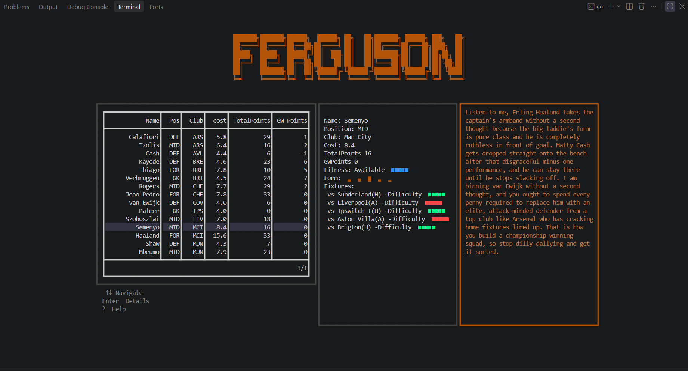

# Ferguson

A TUI dashboard for Fantasy Premier League — Bloomberg Terminal-style, dark,
keyboard-only, multi-pane.

Pulls your live squad, fixtures, and form data from the public FPL API, and
generates an AI-written verdict (captain pick, bench call, one transfer
worth considering) styled as Sir Alex Ferguson's post-match assessment.



## Features

- **Live squad table** — your real 15-man FPL team, fetched from the FPL API each run, with readable position/club labels and formatted costs
- **Fixtures pane** — next 5 fixtures per club in your squad, color-coded by fixture difficulty (FDR)
- **Player detail popup** — fitness status, a mini form sparkline from recent gameweeks, and that player's upcoming fixtures
- **AI verdict pane** — a real AI (Groq, with Gemini as fallback) reasons about your actual squad and fixtures, in character as Sir Alex Ferguson: captain pick, bench call, one transfer worth considering
- **Keyboard-only navigation** — arrow keys to browse and switch panes, `enter`/`esc` for player detail, `?` for help, `q` to quit
- **No mocked data anywhere** — every pane is backed by a live FPL API call or a live AI response

## Architecture

Built on Bubbletea's Model-Update-View pattern: `Model` holds all app state, `Update` is the only place state changes (in response to key presses or async data arriving), and `View` is a pure function of `Model` — it never mutates anything.

All network I/O (FPL API, AI providers) runs through Bubbletea's `tea.Cmd`/`tea.Msg` pattern rather than blocking `Update` directly. On startup, the squad fetch and fixtures fetch dispatch **concurrently** as separate commands (`tea.Batch`), rather than one after another — see [Performance](#performance) below for the measured impact of this. The AI verdict fetch is deliberately *not* dispatched at startup alongside them: it depends on squad and fixture data actually being loaded first, so it's triggered from inside `Update` once both have arrived — whichever one finishes second.

The AI verdict itself tries Groq first (fast, free-tier) and falls back to Google Gemini if Groq fails, so a single provider outage doesn't take down the verdict pane.

## Performance

Startup dispatches the squad and fixtures fetches as concurrent goroutines rather than one after another. Measured with a standalone benchmark ([`bench/main.go`](bench/main.go)), averaged over 5 runs against the real FPL API:

- **Sequential (one after another):** ~834.9ms
- **Concurrent (as implemented):** ~317.0ms
- **~62% reduction** in cold-start latency, bounded by the slowest single call instead of the sum of all of them

## File structure

```
ferguson/
├── main.go        # entry point, flag parsing, tea.NewProgram
├── model.go       # tea.Model struct, Init(), Update(), View()
├── styles.go      # all Lip Gloss style definitions
├── fpl/
│   ├── client.go  # HTTP client, FPL API requests
│   └── types.go   # structs mirroring FPL API JSON
├── ai/
│   ├── client.go  # AI provider requests (Groq, Gemini)
│   └── prompt.go  # Ferguson's Verdict prompt template
├── ui/
│   ├── squad.go, fixtures.go, verdict.go, splash.go, help.go
└── bench/
    └── main.go    # standalone cold-start latency benchmark
```

## Installation

```
go install github.com/Olisaemeka-Paul-Ani/ferguson@latest
```

Or clone and run it directly:

```
git clone https://github.com/Olisaemeka-Paul-Ani/Ferguson.git
cd Ferguson
go run . --team <your_team_id>
```

You'll need two environment variables set for the AI verdict pane to work:

```
FERGUSON_GROQ_KEY=<your Groq API key>
FERGUSON_AI_KEY=<your Google Gemini API key>
```

Your team ID is passed via the `--team` flag each run — there's no config file in V1.

## Usage

```
ferguson --team <your_team_id>
```

| Key | Action |
|---|---|
| `↑` / `↓` | Navigate the squad table |
| `enter` | Open the highlighted player's detail popup |
| `esc` | Close the detail popup |
| `←` / `→` | Switch between panes |
| `?` | Toggle the help overlay |
| `q` | Quit |

## Tech stack

- **Go** — stdlib `net/http` + `encoding/json` only, no other HTTP/JSON dependencies
- [**Bubbletea**](https://github.com/charmbracelet/bubbletea) — terminal UI framework (Model-Update-View)
- [**Lip Gloss**](https://github.com/charmbracelet/lipgloss) — styling
- [**bubble-table**](https://github.com/evertras/bubble-table) — the squad table component
- The public [FPL API](https://fantasy.premierleague.com/api/) — live squad, fixture, and points data
- **Groq** (`llama-3.3-70b-versatile`), with **Google Gemini** (`gemini-3.6-flash`) as fallback — generates the AI verdict
